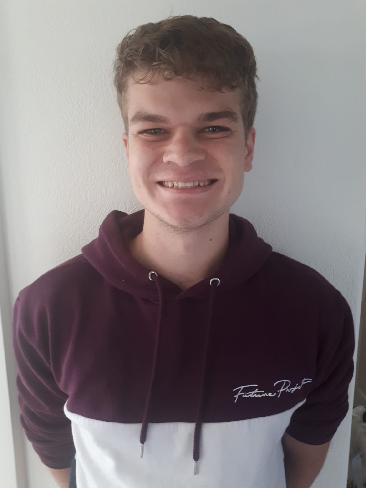

```{r libraries, echo=FALSE}
library(here)
library(knitr)
library(fs) 
library(readxl)
library(tidyverse)
library(toolboxr)
library(ggplot2)
library(patchwork)
library(cowplot)
library(devtools)
library(knitr)
library(dplyr)
library(reshape2)
library(lme4)
library(broom.mixed)
devtools::install_github("uashogeschoolutrecht/toolboxr")
```

```{r setup, echo=FALSE}
knitr::write_bib(c(
  .packages(), 'bookdown', 'knitr', 'rmarkdown'
), 'packages.bib')
knitr::opts_chunk$set(message = FALSE, warning = FALSE)
```

# Curriculum Vitae {-}



----

## Contact {-}
<i class="fa fa-home"></i> Barneveld, The Netherlands<br>
<i class="fa fa-envelope"></i> yourilam2001@gmail.com
<i class="fa fa-phone"></i> +31 6 21203760
<i class="fa fa-github"></i> [github.com/YouriLam](https://github.com/YouriLam)

----

## Profile {-}
I am a young, studious, determined, curious student with a passion for biomedical research. Although my interests mainly lie in lab work, I am also very much at home in bioinformatics. By combining both interests I see myself as an asset in the development of data analysis and biomedical research.

----

## Education {-}
__Hogeschool Utrecht__\
_Bachelor of Science - BS, Life Sciences, Sep. 2019 - Aug. 2024_\
Specialized in Data Sciences for Biology\

## Experience {-}
__Eurofins Analytico B.V. - Barneveld__\
_Pre-treatment Organic Substances Nov. 2021 - Present_\


__Coop BV - Barneveld__\
_Sales Associate, Nov. 2016 - Nov. 2021_

## Skills {-}
R programming language\
Bash command language\
SQL\
Excel\
CSS stylesheet language\
(Cell) culture

## Languages {-}
Dutch - native speaker\
English - C1
